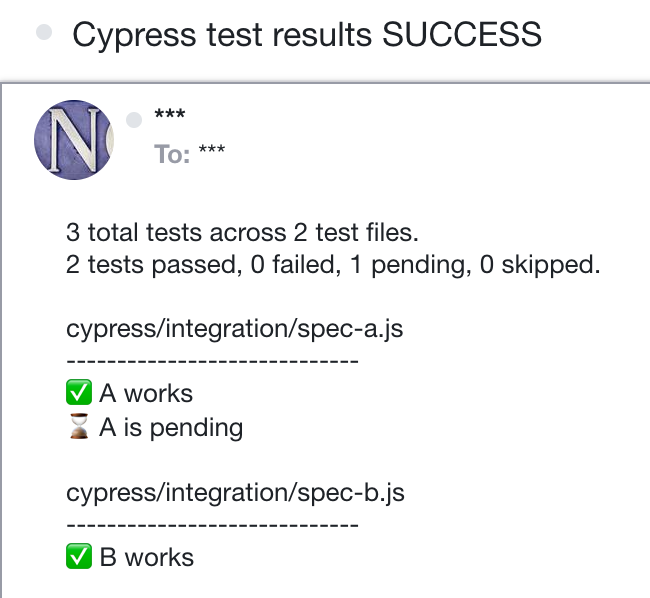

# cypress-email-results [![Build status][ci image]][ci url] [![renovate-app badge][renovate-badge]][renovate-app] 

> Easily email the test results after Cypress is done



## Install

Add this plugin as a dev dependency to your Cypress project

```
# install using NPM
$ npm i -D cypress-email-results
# or using Yarn
$ yarn add -D cypress-email-results
```

Register the plugin from your [cypress/plugins/index.js](./cypress/plugins/index.js) file

```js
module.exports = (on, config) => {
  require('cypress-email-results')(on, config, {
    email: ['user1@email.com', 'user2@email.com'],
  })
}
```

### emailOnSuccess

You can set this plugin to only send an email if the test run has failed

```js
module.exports = (on, config) => {
  require('cypress-email-results')(on, config, {
    email: ['user1@email.com', 'user2@email.com'],
    emailOnSuccess: false,
  })
}
```

### dry

You can print the email instead of sending it using the `dry` option

```js
module.exports = (on, config) => {
  require('cypress-email-results')(on, config, {
    email: ['user1@email.com', 'user2@email.com'],
    dry: true,
  })
}
```

Note: the email client is still initialized.

## Using SendGrid

If you use SendGrid as your SMTP server, set the environment variables for the plugin to read, something like:

```
SENDGRID_HOST=smtp.sendgrid.net
SENDGRID_PORT=465
SENDGRID_USER=...
SENDGRID_PASSWORD=...
SENDGRID_FROM=...
```

## Using non-SendGrid SMTP server

You can create your own smpt transport using [nodemailer](https://nodemailer.com/about/) module.

```js
// create your own SMTP transport
const transport = ...

module.exports = (on, config) => {
  require('cypress-email-results')(on, config, {
    email: ['user1@email.com', 'user2@email.com'],
    // pass your transport object
    transport,
  })
}
```

As long as `transport.sendEmail` exists, the plugin will try to use it to send an email with results.

## Single instance

**Important:** this plugin only sends the test results from the current Cypress instance. If you are using [Cypress parallelization](https://on.cypress.io/parallelization) then each test runner will send its portion of the results.

## Demo

Set the `dry: true` option and run `npm run demo`. To see the demo on CircleCI, run `CI=1 CIRCLECI=1 npm run demo`.

## See also

- plugin [cypress-json-results](https://github.com/bahmutov/cypress-json-results)
- [Cypress ethereal email example](https://github.com/bahmutov/cypress-ethereal-email-example)
- presentation [Full End-to-End Testing for Your HTML Email Workflows](https://slides.com/bahmutov/email-testing)

## Small print

Author: Gleb Bahmutov &lt;gleb.bahmutov@gmail.com&gt; &copy; 2022

- [@bahmutov](https://twitter.com/bahmutov)
- [glebbahmutov.com](https://glebbahmutov.com)
- [blog](https://glebbahmutov.com/blog)
- [videos](https://www.youtube.com/glebbahmutov)
- [presentations](https://slides.com/bahmutov)
- [cypress.tips](https://cypress.tips)
- [Cypress Advent 2021](https://cypresstips.substack.com/)

License: MIT - do anything with the code, but don't blame me if it does not work.

Support: if you find any problems with this module, email / tweet /
[open issue](https://github.com/bahmutov/cypress-email-results/issues) on Github

## MIT License

Copyright (c) 2022 Gleb Bahmutov &lt;gleb.bahmutov@gmail.com&gt;

Permission is hereby granted, free of charge, to any person
obtaining a copy of this software and associated documentation
files (the "Software"), to deal in the Software without
restriction, including without limitation the rights to use,
copy, modify, merge, publish, distribute, sublicense, and/or sell
copies of the Software, and to permit persons to whom the
Software is furnished to do so, subject to the following
conditions:

The above copyright notice and this permission notice shall be
included in all copies or substantial portions of the Software.

THE SOFTWARE IS PROVIDED "AS IS", WITHOUT WARRANTY OF ANY KIND,
EXPRESS OR IMPLIED, INCLUDING BUT NOT LIMITED TO THE WARRANTIES
OF MERCHANTABILITY, FITNESS FOR A PARTICULAR PURPOSE AND
NONINFRINGEMENT. IN NO EVENT SHALL THE AUTHORS OR COPYRIGHT
HOLDERS BE LIABLE FOR ANY CLAIM, DAMAGES OR OTHER LIABILITY,
WHETHER IN AN ACTION OF CONTRACT, TORT OR OTHERWISE, ARISING
FROM, OUT OF OR IN CONNECTION WITH THE SOFTWARE OR THE USE OR
OTHER DEALINGS IN THE SOFTWARE.

[ci image]: https://github.com/bahmutov/cypress-email-results/workflows/ci/badge.svg?branch=main
[ci url]: https://github.com/bahmutov/cypress-email-results/actions
[renovate-badge]: https://img.shields.io/badge/renovate-app-blue.svg
[renovate-app]: https://renovateapp.com/
